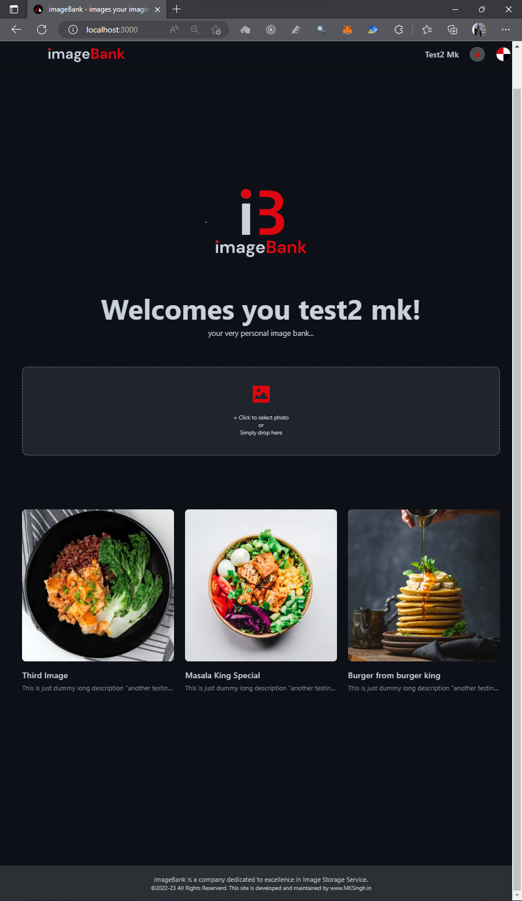
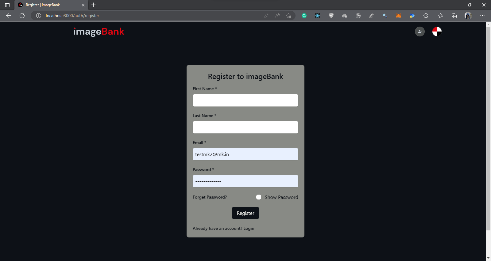
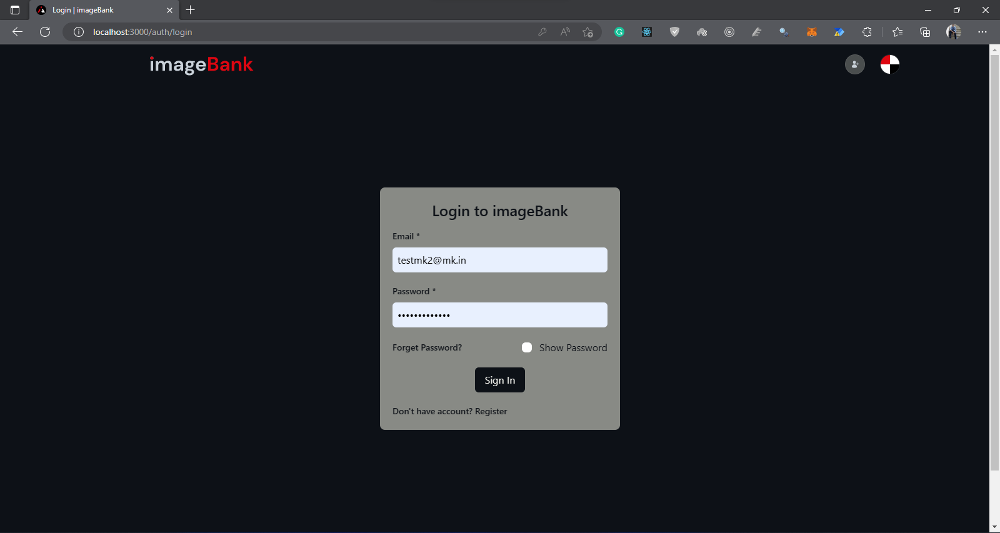

# Image Uploader with Django RestFramework Backend


> setup frontend by running
```bash
    pnpm install
    pnpm dev
```

> setup backend by following the below steps:
1. Create virtual environment
`python -m venv venv`

2. Activate the `venv` -
    - on windows `.\venv\Scripts\activate`

3. Install the requirements
`pip install -r requirements.txt`


### Please find the glimpse of UI below:
#### Neon Home Page


#### Dark Home Page


#### Dark Sign Up Page


#### Dark Login Page
